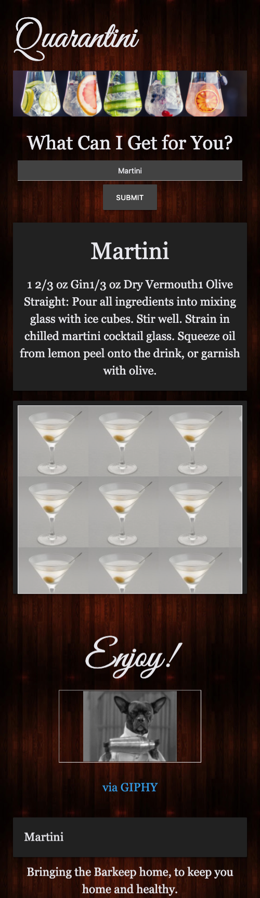

# Quanrantini 

Welcome to Quarantini!
This site is created to help you enjoy a fancy cocktail while staying home. We want to do our part to help you have a little fun while staying home

# Basic layout

The layout was desgined with a mobile first perspective. 
It allows for an easy to view mobile experience. 

This is an example of what the site will look on mobile: 

 

# HTML Modification

the colors are meant to be dark monochromatic with the use of materialize to help with the mobile responisive nature of the site.

# Assets

The live site resides at this url: 
[Deployment environment](https://rylawesome.github.io/Quarantini/)

# Contributers

[BrySondra Williams](https://github.com/lovejustbry)
[Christian Romero](https://github.com/Romer0-c)
[Devante Williams](https://github.com/Devante05)
[Ryland Quirk](https://github.com/rylawesome)

# Future Developments
Incorporate additional API endpoint calls to allow for search feature of only alcohol type. This will allow for the app to reach a wider audience who may not already know what drink name they'd like to search. 
Additionally allow for non alcholic drinks to be searched for those who so choose. 

--